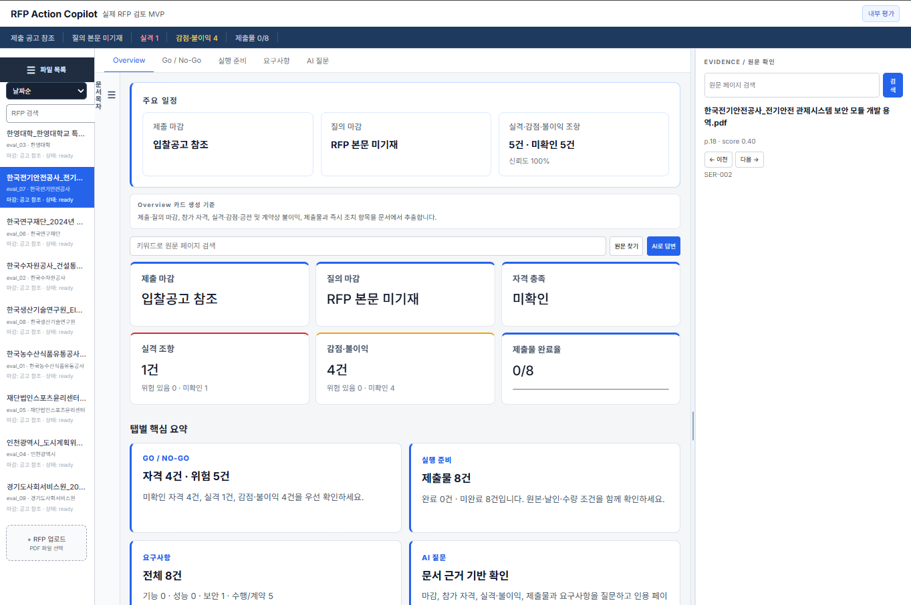

# RFP Copilot

RFP 문서를 업로드하고, 입찰 검토에 필요한 핵심 정보와 원문 근거를 함께 제공하는
업무 지원형 RAG 애플리케이션입니다. 현재 운영 기준 코드는
`aromgu/sprint_mid_project_team1` 저장소의 `dev` 브랜치입니다.

## 현재 구현 상태

- 9개 RFP 문서 기반 Main Advanced RAG 파이프라인
- PDF 전처리, 구조 보존 청킹, Dense/BM25 인덱싱
- 문서 단위 검색 범위 제한과 출처 페이지·요구사항 근거 제공
- Dense 검색을 서비스 기본값으로 사용하고 Hybrid RRF는 평가 모드로 제공
- OpenAI `gpt-5-nano`, Gemini Flash, Gemini Flash Lite 런타임 선택
- 문서 업로드 후 전처리·인덱싱·Workspace 반영
- Overview, Go/No-Go, 위험, 요구사항, 제출물, AI 질의, 평가 화면
- 대화 스트리밍, 상태 변경, 원문 페이지 연결
- Retrieval/RAGAS 평가, W&B 기록, 재개 가능한 배치 실행

현재 개발 내용은 팀 저장소 `dev`에 반영되어 있습니다.

## 빠른 시작

### 1. 저장소와 Git LFS 준비

Python 3.11 이상, Node.js, `uv`, Git LFS가 필요합니다.

```bash
git clone --branch dev https://github.com/aromgu/sprint_mid_project_team1.git
cd sprint_mid_project_team1
git lfs install
git lfs pull
uv sync
uvx prek install
```

### 2. 환경변수 설정

```bash
cp .env.example .env
```

사용할 공급자에 맞춰 `.env`에 API 키를 설정합니다. API 키는 Git에 커밋하지
않습니다.

```dotenv
OPENAI_API_KEY=...
GEMINI_API_KEY=...
```

Main Advanced 기본 검색 인덱스는 OpenAI embedding으로 생성되어 있으므로 해당
경로를 사용할 때는 `OPENAI_API_KEY`가 필요합니다.

### 3. 백엔드 실행

```bash
uv run uvicorn backend.main:app --reload --host 127.0.0.1 --port 8000
```

API 문서:

```text
http://127.0.0.1:8000/docs
```

### 4. 프런트엔드 실행

별도 터미널에서 실행합니다.

```bash
cd frontend
npm ci
npm run dev
```

기본 접속 주소는 `http://127.0.0.1:5173`입니다. Vite 개발 서버는 `/api` 요청을
백엔드 `http://127.0.0.1:8000`으로 전달합니다.

## 서비스 구성

```text
PDF 업로드
  -> 문서 manifest 및 구조 보존 전처리
  -> 텍스트·표 청킹
  -> OpenAI Dense/Chroma 및 Kiwi BM25 인덱스
  -> 문서 범위 제한 검색
  -> 근거 기반 답변 생성
  -> React Workspace와 평가 화면
```

Main Advanced 설정은
[`configs/main_advanced_rag.yaml`](configs/main_advanced_rag.yaml)에서 관리합니다.

| 항목 | 현재 기본값 |
|---|---|
| corpus | 9개 RFP 문서 |
| chunk artifact | `data/main_advanced/chunks/chunks_advanced.jsonl.gz` |
| Dense model | `text-embedding-3-small`, 1536차원 |
| 검색 모드 | Dense |
| 검색 `top_k` | 10 |
| 답변 모델 | `gpt-5-nano` |
| 최대 문맥 | 7,000자 |
| Hybrid | Dense 0.3 + BM25 0.7, weighted RRF |
| reranker | 비활성화 |

## Main Advanced 파이프라인

### 청킹

현재 스크립트 기본값은 1024 tokens, overlap 102, worker 4입니다. 긴 작업은
checkpoint와 `--resume`을 사용합니다.

```bash
uv run python -m scripts.main_rag.run_advanced_chunking \
  --max-workers 4 --resume
```

기존 512/51 평가 artifact를 재현하려면 크기를 명시하고 출력 경로를 분리합니다.

```bash
uv run python -m scripts.main_rag.run_advanced_chunking \
  --chunk-size 512 --chunk-overlap 51 --max-workers 4 \
  --output data/main_advanced/chunks_512/chunks_advanced.jsonl.gz \
  --report reports/main_advanced_512/advanced_chunking_report.json
```

### 인덱싱

```bash
uv run python -m scripts.main_rag.run_advanced_indexing
```

Dense, BM25 또는 두 인덱스를 함께 생성할 수 있습니다. 상세 옵션은 다음으로
확인합니다.

```bash
uv run python -m scripts.main_rag.run_advanced_indexing --help
```

### Retrieval 평가

한 건 smoke를 먼저 실행합니다.

```bash
uv run python -m scripts.main_rag.evaluate_retrieval \
  --retriever all --limit 1 --top-k 5 \
  --output-dir /tmp/main_advanced_retrieval_smoke
```

전체 평가는 latency 비교 재현성을 위해 worker 1로 실행하며, 완료 결과를
재사용합니다.

```bash
uv run python -m scripts.main_rag.evaluate_retrieval \
  --retriever all --top-k 5 --max-workers 1 --resume \
  --output-dir reports/main_advanced/retrieval_comparison
```

### 답변 생성

독립 API 요청의 안전한 기본 병렬값은 worker 4입니다.

```bash
uv run python -m scripts.main_rag.run_answers \
  --top-k 10 --max-workers 4 --resume \
  --output reports/main_advanced/answers_top10.jsonl
```

## 현재 Retrieval 평가 결과

9개 문서, Golden v3의 답변 가능 질문 95개, `top_k=5`, 512/51 인덱스 기준입니다.

| 지표 | Dense | Hybrid RRF |
|---|---:|---:|
| Hit@1 | 0.6105 | 0.5684 |
| Hit@3 | 0.7789 | 0.7684 |
| Hit@5 | 0.8842 | 0.8105 |
| MRR@10 | 0.7084 | 0.6679 |
| Section recall@5 | 0.5070 | 0.5860 |
| Fact coverage@5 | 0.6877 | 0.6035 |
| 평균 latency | 284.4 ms | 341.2 ms |
| p95 latency | 384.2 ms | 422.7 ms |

Hybrid는 section recall에서는 앞섰지만 Hit@5, MRR, fact coverage와 latency의 채택
기준을 충족하지 못했습니다. 따라서 Dense가 서비스 기본값이며 Hybrid RRF는 가중치와
candidate 수를 조정하는 실험 기능으로 유지합니다.

상세 결과는
[`reports/main_advanced/retrieval_comparison_512/RESULT.md`](reports/main_advanced/retrieval_comparison_512/RESULT.md)를 참고합니다.

## 주요 API

`backend.main:app`이 Workspace용 통합 API입니다.

- 문서: 목록, 상세, 업로드, 목차, 원문 검색
- 분석: Overview, 위험, 참가 자격, 요구사항, 제출물
- 질의: 일반 응답, 스트리밍 응답, 대화 초기화
- 상태: 자격·위험·제출물 상태 변경
- 평가: 요약과 Main Advanced/RAGAS 보고서

검색·답변만 제공하는 경량 API는 다음과 같이 실행할 수 있습니다.

```bash
uv run uvicorn src.api:app --host 127.0.0.1 --port 8000
```

경량 API는 `GET /health`, `POST /search`, `POST /answer`를 제공합니다.

## 테스트

변경 관련 테스트를 먼저 실행하고, 통과 후 전체 회귀를 한 번 실행합니다.

```bash
uv run pytest -q tests/test_main_advanced_rag.py tests/test_backend_mvp.py
uv run pytest -q
```

프런트엔드 검증:

```bash
cd frontend
npm run build
npm run test:ui
```

실제 FastAPI/OpenAI 브라우저 E2E는 비용이 발생하는 opt-in 테스트입니다. 일반 UI
회귀에서는 자동으로 건너뜁니다. 테스트 병렬값과 실행 원칙은
[`docs/TEST_EXECUTION_POLICY.md`](docs/TEST_EXECUTION_POLICY.md)를 따릅니다.

## 주요 디렉터리

```text
backend/                     FastAPI Workspace 백엔드
frontend/                    React/Vite UI와 Playwright 테스트
configs/                     ingestion, 검색, 생성, Main Advanced 설정
src/main_rag/                Main Advanced 검색·생성·서비스 계층
scripts/main_rag/            청킹, 인덱싱, 답변, 평가 실행 스크립트
data/main_advanced/          manifest, 전처리, chunk, 검색 인덱스
goldenset/                   Golden v3 평가 질문
reports/main_advanced/       Retrieval, 답변, RAGAS 평가 결과
reports/development_report/  개발 보고서 산출물
reports/presentation/        발표 자료
docs/                        실행 정책, 도입 계획, 사용성 문서
tests/                       Python 회귀 테스트
```

## 참고 문서

- [테스트 실행 정책](docs/TEST_EXECUTION_POLICY.md)
- [10개 문서 도입 계획](docs/MAIN_PIPELINE_10_DOCUMENT_ADOPTION_PLAN.md)
- [사용성 테스트 피드백과 수정 사항](docs/USABILITY_TEST_FEEDBACK_AND_FIXES.md)
- [최근 작업 요약](docs/WORK_SUMMARY_2026-07-29.md)
- [Retrieval 512/51 비교 결과](reports/main_advanced/retrieval_comparison_512/RESULT.md)

## 보안 및 데이터 관리

- `.env`, API 키, credential은 커밋하지 않습니다.
- 원본 PDF와 바이너리 검색 artifact는 Git LFS로 관리합니다.
- 유료 API 평가는 대표 smoke가 성공한 뒤 전체 batch를 실행합니다.
- 장시간 평가는 `--resume`과 별도 output 경로를 사용해 성공 결과를 재사용합니다.

## RAG Copilot UI


