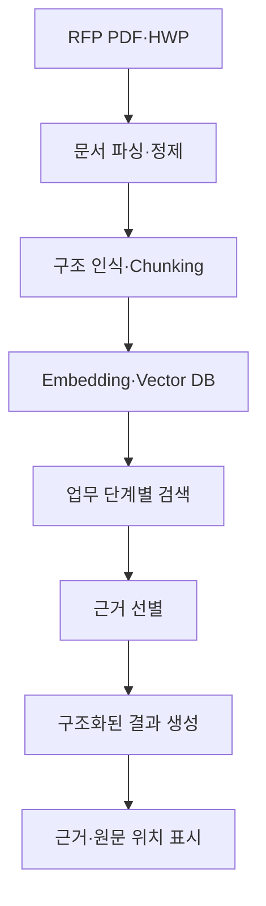

# 사용자 판단 흐름 기반 RFP Copilot 개발 보고서 구성안

## 부제

공공 RFP의 탐색·검토·의사결정을 지원하는 근거 기반 RAG 애플리케이션

---

## 1. 프로젝트 개요

### 1.1 개발 배경

공공기관의 RFP는 문서가 길고, 사업 개요·참가 자격·기술 요구사항·평가 기준·제출 일정 등이 본문과 표, 첨부 문서에 분산되어 있다. 사용자는 짧은 시간 안에 여러 정보를 종합하여 입찰 참여 가능성과 준비 방향을 판단해야 한다.

기존의 일반적인 RAG 서비스는 사용자의 질문에 관련 문서를 검색하여 답변하는 데 초점을 둔다. 그러나 실제 RFP 업무에서는 사용자가 무엇을 질문해야 하는지부터 판단해야 하며, 개별 답변만으로는 입찰 참여 여부나 후속 업무를 결정하기 어렵다.

따라서 본 프로젝트는 단순한 RFP 질의응답 챗봇이 아니라, **사용자가 RFP를 검토하는 생각의 순서에 맞춰 필요한 정보와 근거를 제공하는 RFP Copilot App**을 개발하는 것을 목표로 하였다.

### 1.2 프로젝트 목표

- RFP의 핵심 정보를 사용자의 검토 순서에 맞게 구조화한다.
- 사용자가 입찰 참여 가능성과 주요 위험을 빠르게 파악하도록 돕는다.
- 답변뿐 아니라 판단에 필요한 원문 근거를 함께 제공한다.
- 요구사항, 평가 기준, 제출물 등을 후속 업무에 사용할 수 있는 형태로 정리한다.
- 사용자의 질문 부담과 반복적인 문서 탐색 시간을 줄인다.

### 1.3 대상 사용자

- 입찰·영업 담당자
- 제안 PM
- 기술 검토자
- 제안서 작성자
- 입찰 참여 여부를 결정하는 관리자

### 1.4 팀 구성과 담당 역할

이 절에서는 팀원별 역할을 간단히 정리하고, 본인이 담당한 범위를 명확히 구분한다.

본인의 핵심 역할은 다음과 같이 기술할 수 있다.

> RFP 사용자의 의사결정 과정을 분석하고, 이를 제품 요구사항, 정보 구조, 화면 흐름, RAG 검색 단위 및 출력 형식으로 변환하였다.

---

## 2. 문제 정의

### 2.1 기존 RFP 검토 업무의 어려움

- 문서의 분량이 많고 형식이 일정하지 않다.
- 중요한 정보가 본문, 표, 부록 및 첨부 문서에 분산되어 있다.
- 참가 자격, 일정, 예산, 요구사항, 평가 기준을 함께 검토해야 한다.
- 단순 요약만으로는 입찰 참여 여부를 판단하기 어렵다.
- 중요한 조건을 놓치면 입찰 탈락이나 제안 준비 실패로 이어질 수 있다.
- AI가 제공한 답변도 원문에서 다시 확인해야 한다.

### 2.2 일반적인 RAG 질의응답 방식의 한계

- 사용자가 먼저 적절한 질문을 만들어야 한다.
- 검색 결과가 실제 업무 단계와 연결되지 않는다.
- 개별 질문에는 답하지만 다음 판단이나 행동을 안내하지 못한다.
- 필수조건이나 요구사항의 누락 여부를 확인하기 어렵다.
- 답변의 원문 위치가 명확하지 않으면 업무에 활용하기 어렵다.

### 2.3 문제의 재정의

본 프로젝트는 문제를 다음과 같이 재정의하였다.

> “RFP에 대해 무엇이든 질문할 수 있게 하는 것”이 아니라,\
> “사용자가 RFP를 검토하고 판단하는 순서에 맞춰 필요한 정보와 근거를 먼저 제공하는 것”을 해결해야 할 문제로 정의하였다.

이러한 재정의를 통해 제품의 중심을 **질문 중심 챗봇**에서 **업무 판단을 지원하는 Copilot**으로 전환하였다.

---

## 3. 사용자와 업무 흐름 분석

### 3.1 사용자의 핵심 목적

RFP 사용자의 목적은 문서 내용을 모두 읽는 것이 아니다. 사용자는 제한된 시간 안에 다음 사항을 판단하려 한다.

- 이 사업이 우리 회사와 관련 있는가?
- 우리 회사가 참여할 자격이 있는가?
- 사업 규모와 일정은 적절한가?
- 기술적으로 수행 가능한가?
- 어떤 항목이 중요하게 평가되는가?
- 반드시 지켜야 할 조건은 무엇인가?
- 참여한다면 무엇을 먼저 준비해야 하는가?

### 3.2 사용자의 생각 흐름

| 단계 | 사용자의 핵심 질문 | Copilot이 제공할 정보 |
|---|---|---|
| 사업 발견 | 우리 회사와 관련 있는 사업인가? | 사업 목적, 발주 분야, 주요 과업 |
| 빠른 검토 | 예산·기간·마감일은 무엇인가? | 핵심 정보 요약 카드 |
| 적격성 판단 | 우리가 참여할 수 있는가? | 참가 자격, 제한조건, 필수 인증 |
| 수행 가능성 검토 | 기술적으로 수행할 수 있는가? | 기술·기능·운영 요구사항 |
| 경쟁성 판단 | 무엇으로 평가받는가? | 평가항목, 배점, 가점 요소 |
| 위험 검토 | 놓치면 탈락하는 조건은 무엇인가? | 필수조건, 제출조건, 주요 리스크 |
| 참여 판단 | 입찰에 참여할 것인가? | 판단 근거가 포함된 검토 요약 |
| 제안 준비 | 누가 무엇을 준비해야 하는가? | 요구사항 및 제출물 체크리스트 |

### 3.3 대표 사용자 시나리오

1. 사용자가 검토할 RFP 문서를 등록하거나 선택한다.
2. 사업 개요, 예산, 기간 및 마감일을 확인한다.
3. 참가 자격과 제한조건을 검토한다.
4. 주요 요구사항과 사업 수행 범위를 확인한다.
5. 평가항목, 배점 및 가점 요소를 파악한다.
6. 위험조건과 반드시 제출해야 하는 자료를 확인한다.
7. 필요한 경우 답변의 원문 근거로 이동하여 내용을 검증한다.
8. 내부 검토용 체크리스트를 생성한다.
9. 입찰 참여 여부와 후속 업무를 결정한다.

---

## 4. 제품 요구사항

### 4.1 핵심 기능

- RFP 문서 등록 및 분석
- 사업 개요 자동 구조화
- 참가 자격 및 제한조건 추출
- 주요 요구사항 분류
- 평가항목·배점·가점 요소 정리
- 제출물 및 주요 일정 정리
- 위험조건 및 누락 가능 항목 표시
- 답변의 근거 문장과 원문 위치 제공
- 세부 내용을 확인하기 위한 추가 질의응답
- 내부 검토용 체크리스트 생성

### 4.2 MVP 범위

본 프로젝트의 MVP는 다음 기능에 집중한다.

1. RFP 문서 등록
2. 핵심 정보 추출 및 구조화
3. 참가 자격·요구사항·평가항목 분석
4. 근거가 포함된 질의응답
5. 검토 체크리스트 제공

다음 기능은 현재 MVP 범위에서 제외하고 향후 확장 대상으로 분류한다.

- 회사 내부 실적 및 보유 역량 자동 매칭
- 여러 RFP의 자동 비교와 우선순위 추천
- 제안서 전체 자동 작성
- 입찰 참여 여부의 자동 결정
- 실제 수주 가능성 예측

### 4.3 제품 설계 원칙

- **사용자 흐름 우선:** 기술 기능이 아니라 사용자의 검토 순서에 따라 화면을 구성한다.
- **근거 우선:** 모든 중요한 결과는 원문 근거와 함께 제공한다.
- **판단 지원:** AI가 최종 결정을 대신하지 않고 사용자가 판단할 정보를 구조화한다.
- **누락 방지:** 필수조건, 제출물, 일정 등 실패 위험이 큰 항목을 우선 표시한다.
- **점진적 정보 제공:** 처음에는 핵심 정보를 보여주고, 필요한 경우 상세 내용으로 이동하게 한다.

---

## 5. 서비스와 화면 설계

### 5.1 전체 화면 구조

| 화면 | 사용자의 목적 | 주요 기능 |
|---|---|---|
| RFP 목록 | 검토할 사업을 찾고 선택 | 검색, 필터, 검토 상태 |
| RFP 개요 | 사업을 빠르게 파악 | 발주처, 예산, 기간, 마감일, 주요 과업 |
| 적격성 검토 | 참여 가능 여부 확인 | 참가 자격, 제한조건, 필수 인증 |
| 요구사항 분석 | 수행 범위와 난이도 파악 | 기능·기술·운영·보안 요구사항 |
| 평가전략 | 평가의 핵심 파악 | 평가항목, 배점, 가점 요소 |
| 리스크·체크리스트 | 누락과 탈락 위험 방지 | 필수조건, 제출물, 일정, 확인 상태 |
| 근거 질의응답 | 세부 내용 확인 | 답변, 인용 근거, 원문 위치 |

### 5.2 화면 설계 기준

각 화면은 기술 모듈이 아니라 사용자의 질문 하나에 답하도록 구성한다.

예를 들어 적격성 검토 화면은 단순히 검색 결과를 나열하지 않고 다음 정보를 구분하여 표시한다.

- 참여 가능 조건
- 참여 제한 조건
- 공동수급 관련 조건
- 필수 자격과 인증
- 추가 확인이 필요한 모호한 조건
- 각 조건의 원문 근거

### 5.3 개발 정보 표시

RAG 개발 과정의 실험과 검증 결과는 사용자 업무 화면의 중심에 노출하지 않는다. 다만 개발 또는 점검이 필요한 경우, 각 기능의 개별 개발 화면에서 다음 정보를 확인할 수 있도록 구성한다.

- 검색된 문서 조각
- 답변 생성에 사용된 근거
- 적용된 검색·처리 단계
- 기능별 처리 결과
- 오류 또는 예외 발생 내용

이를 통해 최종 사용자의 화면은 단순하게 유지하면서도, 개발자는 기능별 처리 상태를 확인할 수 있다.

---

## 6. RAG 시스템 설계

### 6.1 전체 처리 흐름

### 6.2 문서 처리

이 절에는 다음 내용을 정리한다.

- 입력 문서 형식
- PDF·HWP 처리 방식
- 본문, 표, 제목 및 부록 구분
- 페이지와 섹션 정보 보존
- 문서 처리 실패 시 예외 대응

### 6.3 정보 검색 구조

RFP 전체를 하나의 질문 대상으로만 처리하지 않고, 사용자의 업무 단계에 따라 검색 목적을 구분한다.

예:

- 사업 개요 검색
- 참가 자격 및 제한조건 검색
- 기술 요구사항 검색
- 평가항목 및 배점 검색
- 제출물과 일정 검색
- 위험조건 검색

### 6.4 구조화 출력

검색 결과는 자유로운 문장만으로 제공하지 않고, 업무에서 재사용할 수 있도록 정해진 필드로 구조화한다.

주요 출력 항목:

- 사업명
- 발주기관
- 사업 목적
- 예산
- 수행 기간
- 입찰 및 제출 일정
- 참가 자격
- 제한조건
- 주요 요구사항
- 평가항목과 배점
- 필수 제출물
- 위험요소
- 근거 문장
- 원문 페이지 또는 섹션

### 6.5 근거와 추적성

사용자가 AI의 답변을 실제 업무에 활용하려면 원문 확인이 가능해야 한다. 이를 위해 다음 정보를 함께 제공한다.

- 답변의 근거 문장
- 문서명
- 페이지 또는 섹션
- 관련 표 또는 항목

페이지와 섹션 메타데이터를 보존하는 이유는 검색 정확도뿐 아니라, 사용자가 결과를 원문에서 다시 검증할 수 있도록 하기 위해서다.

---

## 7. 본인이 수행한 핵심 개발

### 7.1 제품 방향 재정의

- 일반적인 RFP QA 챗봇의 한계를 분석하였다.
- 프로젝트의 목표를 질문 답변에서 사용자 판단 지원으로 전환하였다.
- 제품의 방향을 RFP Copilot으로 구체화하였다.

### 7.2 사용자 사고 흐름 설계

- 사용자가 RFP를 검토할 때 거치는 판단 단계를 정의하였다.
- 각 단계에서 사용자가 확인해야 할 핵심 질문을 도출하였다.
- 사용자 질문을 화면, 기능 및 출력 정보와 연결하였다.

### 7.3 정보 구조 설계

다음 핵심 정보가 사용자 흐름에 맞게 제공되도록 구조를 설계하였다.

- 사업 개요
- 참가 자격
- 제한조건
- 주요 요구사항
- 평가항목과 배점
- 제출물과 일정
- 위험조건
- 원문 근거

### 7.4 화면과 기능 연결

- 사용자의 판단 단계와 화면 구조를 연결하였다.
- 요약, 상세 분석, 근거 확인 및 체크리스트가 하나의 업무 흐름으로 이어지도록 구성하였다.
- 최종 사용자 화면과 개발 확인용 화면의 목적을 구분하였다.

### 7.5 RAG 결과의 제품화

- 검색 결과를 단순 답변이 아니라 구조화된 업무 정보로 변환하였다.
- 사용자가 결과의 신뢰성을 확인할 수 있도록 근거 표시 방식을 설계하였다.
- AI가 최종 결정을 내리는 대신 사용자의 판단을 지원하도록 역할 범위를 설정하였다.

### 7.6 본인 기여 요약문

> 본 프로젝트에서 나는 RFP 사용자의 실제 업무와 의사결정 흐름을 분석하고, 이를 RFP Copilot의 제품 구조로 전환하였다. 단순 질의응답 방식의 한계를 바탕으로 사용자의 검토 단계를 정의했으며, 각 단계에서 필요한 정보, 화면, RAG 검색 목적 및 구조화 출력 항목을 연결하였다. 또한 사용자가 AI의 결과를 원문에서 확인할 수 있도록 근거 중심의 정보 제공 방식을 설계하였다.

---

## 8. 구현 결과

### 8.1 구현 기능

실제로 구현한 기능을 화면 단위로 정리한다.

| 구현 화면·기능 | 제공 정보 | 사용자가 얻는 가치 |
|---|---|---|
| RFP 개요 | 사업 목적, 발주처, 예산, 기간 | 사업의 빠른 이해 |
| 적격성 검토 | 참가 자격, 제한조건 | 참여 가능성 판단 |
| 요구사항 분석 | 주요 기술·운영 요구사항 | 수행 범위 파악 |
| 평가항목 분석 | 평가 기준, 배점, 가점 | 제안 준비의 우선순위 설정 |
| 리스크·체크리스트 | 필수조건, 일정, 제출물 | 누락 및 탈락 위험 감소 |
| 근거 확인 | 인용 문장, 페이지, 섹션 | 결과의 신뢰성과 검증 가능성 확보 |

### 8.2 사용자 흐름 구현 결과

구현된 App이 다음 흐름을 지원하는지 설명한다.

> RFP 선택 → 사업 개요 파악 → 참가 가능성 확인 → 요구사항 분석 → 평가 기준 확인 → 위험 및 제출물 점검 → 근거 확인 → 후속 업무 결정

### 8.3 주요 화면

이 절에는 최종 App의 화면 캡처를 배치한다. 각 화면 아래에는 기능 이름보다 다음 내용을 중심으로 설명한다.

- 사용자가 이 화면에서 해결하는 문제
- 사용자가 확인해야 할 핵심 정보
- 다음 화면 또는 후속 업무와의 연결

---

## 9. 한계와 향후 발전

### 9.1 현재 한계

- 회사의 실제 역량, 실적, 인력 및 인증 데이터가 연결되어 있지 않다.
- RFP 정보만으로 최종 입찰 참여 여부를 자동 결정할 수 없다.
- 복잡한 표, 스캔 문서 및 일부 HWP 문서 처리에 한계가 있다.
- 자동 추출 결과에는 사람의 최종 검토가 필요하다.
- 실제 제안서 품질이나 수주 성공률까지 검증한 것은 아니다.

### 9.2 향후 발전 방향

- 회사의 실적·인력·인증정보와 RFP 요구사항 자동 매칭
- 여러 RFP 비교 및 사업 우선순위 검토
- 요구사항별 담당자와 준비 상태 관리
- 제안서 목차 및 초안 작성 지원
- RFP 요구사항–제안서 내용–근거자료 간 Traceability
- 조직별 검토 의견과 승인 흐름 연결

### 9.3 사람과 AI의 역할

AI는 다음 업무를 지원한다.

- 긴 문서에서 관련 정보를 찾는다.
- 여러 위치에 분산된 내용을 구조화한다.
- 확인해야 할 항목과 근거를 제시한다.
- 반복적인 문서 탐색과 정리 부담을 줄인다.

사람은 다음 판단을 담당한다.

- 회사의 실제 수행 역량 판단
- 사업의 전략적 가치 평가
- 위험 수용 여부 결정
- 입찰 참여 및 제안 전략의 최종 결정

---

## 10. 프로젝트 회고

### 10.1 초기 접근

프로젝트 초기에는 RFP 문서를 대상으로 질문하면 답을 제공하는 일반적인 RAG 서비스를 고려하였다.

### 10.2 관점의 변화

실제 RFP 업무를 검토하면서 사용자가 항상 정확한 질문을 알고 있는 것은 아니며, 개별 답변만으로는 입찰 참여나 제안 준비를 결정할 수 없다는 점을 확인하였다.

이에 따라 기술 기능에서 출발하는 대신 다음 질문에서 제품 설계를 시작하였다.

> “사용자는 RFP를 처음 접한 순간부터 어떤 순서로 생각하고 무엇을 판단하는가?”

이 질문을 바탕으로 사용자의 판단 단계를 정리하고, 각 단계에 필요한 정보와 기능을 연결하여 RFP Copilot 구조를 설계하였다.

### 10.3 배운 점

- 좋은 RAG 제품은 검색 정확도만으로 완성되지 않는다.
- 사용자가 실제로 수행하는 업무와 판단 과정을 먼저 이해해야 한다.
- 사용자가 질문을 만들게 하기보다 필요한 질문을 제품이 구조화해 줄 필요가 있다.
- 업무용 AI에서는 답변 자체만큼 근거와 원문 추적성이 중요하다.
- AI는 사람의 최종 결정을 대신하기보다 판단 부담을 줄이는 방향으로 설계해야 한다.

### 10.4 최종 회고문

> 이번 프로젝트를 통해 RAG를 문서 질의응답 기술이 아니라 사용자의 복잡한 판단 과정을 지원하는 제품 구성 요소로 이해하게 되었다. 내가 수행한 핵심 작업은 RFP 사용자의 생각 흐름을 분석하고, 이를 화면과 기능, 정보 구조 및 근거 중심의 RAG 결과로 변환한 것이다. 앞으로는 회사 내부 데이터와 연결하여 RFP 검토에서 제안 준비까지 이어지는 실질적인 업무 Copilot으로 확장할 수 있다.

---

## 11. 결론

본 프로젝트는 RFP 문서에 대한 개별 질문에 답하는 챗봇이 아니라, 사용자가 사업을 발견하고 적격성, 수행 가능성, 평가 기준 및 위험요소를 차례로 검토할 수 있도록 지원하는 RFP Copilot App을 개발하였다.

프로젝트의 핵심 성과는 RAG 기술 자체에 머무르지 않고, **RFP 사용자의 생각 흐름을 제품의 정보 구조와 화면 흐름으로 전환한 것**이다. 이를 통해 사용자는 긴 RFP를 처음부터 모두 읽거나 질문을 일일이 구성하지 않고도 중요한 판단 항목과 원문 근거를 확인할 수 있다.

RFP Copilot은 사람의 결정을 대신하지 않는다. 대신 사용자가 놓치기 쉬운 정보를 구조화하고, 판단에 필요한 근거를 제공함으로써 RFP 검토와 제안 준비의 부담을 줄이는 것을 목표로 한다.

---

## 부록 권장 항목

- 전체 서비스 화면 흐름
- 주요 화면 캡처
- 핵심 정보 출력 스키마
- 사용자 시나리오
- 팀 역할 분담표
- 기능별 구현 현황
- 사용 기술 및 개발 환경
